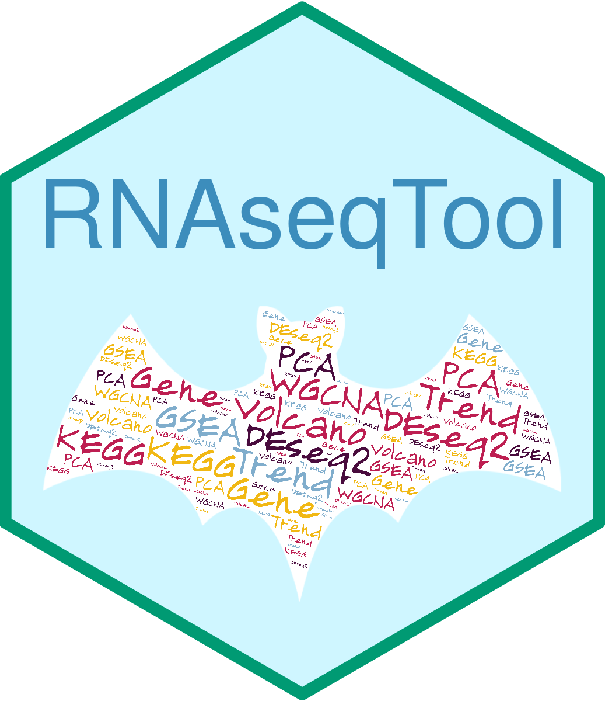
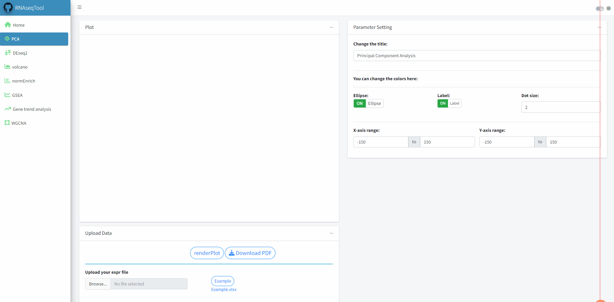

## RNAseqTool: A Shiny App for Interactive RNAseq Analysis and Visualization  

RNAseqTool provides an interactive and user-friendly method for users to analyze RNAseq data, which could be a great solution for RNAseq data analysis and visualization. Here are some potential features that the Shiny App could include:

- Interactive visualization

- [Principal component analysis (PCA)](#h1)

- [Differential gene expression analysis](#h2)

- [Volcano plot](#h3)

- Gene enrichment analysis based on databases such as GO and KEGG
  
  *Supports 20 species, 23 databases*
  
  - [Over Representation Analysis (ORA) ](#h4)
  - [Gene Set Enrichment Analysis (GSEA) ](#h5)
  
- [Gene trend analysis](#h6)

- [Weighted correlation network analysis (WGCNA) ](#h7)

- Data Export: PDF & XLSX

## Installation

You can install the development version of RNAseqTool from [GitHub](https://github.com/) with:

```R
# install.packages("devtools")
devtools::install_github("ChaoXu1997/RNAseqTool")
```

## <span id = "h1">Principal Component Analysis (PCA)</span>

> **Analysis:**  prcomp {stats};  **Visualization:** {ggplot2 }

Principal Component Analysis (PCA) is a widely used technique in RNA sequencing (RNAseq) data analysis. It can be useful in identifying outliers or batch effects that may be present in the data. Outliers are samples that have unusual expression patterns compared to other samples, while batch effects are systematic variations in gene expression that are introduced during the experimental or sequencing process. Overall, PCA is a powerful tool for visualizing and analyzing RNAseq data, and it can help to identify potential issues that may need to be addressed in downstream analyses.




## <span id = "h2">Differential Gene Expression Analysis</span>

> **Analysis:** {DEseq2}

Differential gene expression analysis is a common task in RNA sequencing (RNAseq) data analysis, and DESeq2 is a widely used software package for this purpose.


## <span id = "h3">Volcano Plot</span>

> **Visualization:** {ggplot2}

A volcano plot is a commonly used graphical tool for visualizing the results of differential gene expression analysis. It displays the log2 fold change (log2FC) on the x-axis and  -log10(adj.p-value) on the y-axis. volcano plots are a powerful and commonly used tool for visualizing the results of differential gene expression analysis and can help researchers to identify key genes and pathways that are affected by changes in gene expression.


## <span id = "h4">Over Representation Analysis (ORA) </span>

> **Analysis:** enricher {clusterProfiler}; **Visualization:** {ggplot2}

Gene enrichment analysis can help to identify the key biological processes and pathways that are affected by changes in gene expression, and can provide insights into the underlying mechanisms of disease or cellular processes. It can also be used to validate results from differential gene expression analysis and to generate new hypotheses for further experimental validation. ORA involves comparing a set of differentially expressed genes to a database of known pathways or functional annotations and identifying those that are significantly overrepresented in the gene set. The output of gene enrichment analysis typically includes a list of enriched pathways or functional categories, along with statistical measures such as p-values or false discovery rates (FDRs). 


## <span id = "h5">Gene Set Enrichment Analysis (GSEA) </span>

> **Analysis:** GSEA {clusterProfiler}; **Visualization:** {GseaVis}; **Database:** {msigdbr}

GSEA can be applied to a wide variety of genomic data, including gene expression, copy number variation, and DNA methylation data, and can be used to identify pathways or biological processes that are differentially regulated between two groups of samples. GSEA involves the comparison of the expression of a pre-defined set of genes (a gene set) between two groups of samples, such as disease vs. healthy, or treatment vs. control. It has been widely used in biomedical research to uncover the underlying biological mechanisms involved in diseases and drug responses, and to identify potential biomarkers and therapeutic targets.


## <span id = "h6">Gene Trend Analysis</span>

> **Analysis:** {Mfuzz}; **Visualization:** {ggplot2} **Database:** {msigdbr}

Gene trend analysis is a method for identifying genes that have similar expression patterns across different experimental conditions. This type of analysis is particularly useful for identifying genes that are involved in common biological pathways or processes. One commonly used method for gene trend analysis is fuzzy clustering, which is implemented in the Mfuzz package in R. Fuzzy clustering allows genes to belong to more than one cluster, which can be useful for identifying genes that have complex or overlapping expression patterns. Overall, gene trend analysis is a powerful tool for identifying genes that are involved in common biological pathways or processes. By identifying these genes, researchers can gain insight into the underlying mechanisms of complex diseases and develop new therapeutic targets.


## <span id = "h7">WGCNA Analysis</span>

> **Analysis & Visualization:** {WGCNA}

Weighted Gene Co-expression Network Analysis (WGCNA) is a powerful systems biology approach that can be used to identify co-expressed genes and their relationships with clinical or phenotypic traits. It is implemented in R and requires a set of gene expression data and sample information, such as clinical or phenotypic traits.


